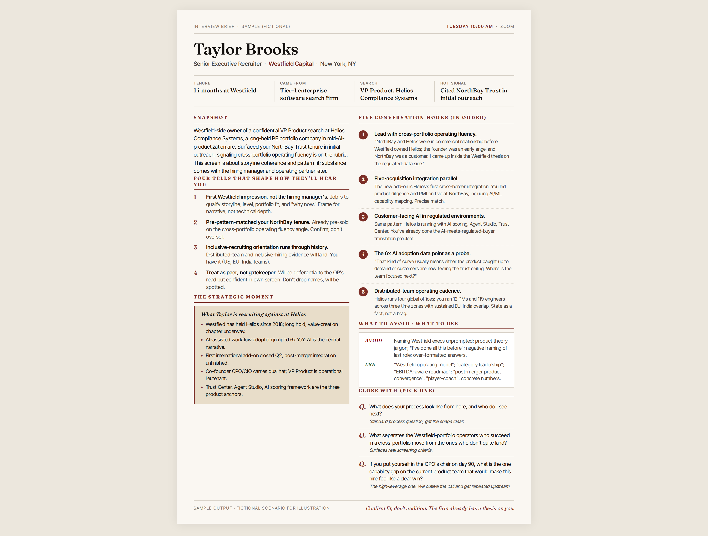

# Job Interview Meeting Preparation

A Claude plugin for preparing a candidate, advisor, or operator for a
high-stakes professional meeting. Researches the company and
stakeholder, synthesizes the strategic picture, and produces two
deliverables: a detailed in-conversation brief and a printable
one-pager rendered to HTML and PDF.

Built originally for interview prep against private-equity portfolio
companies, where the stakeholder is often a recruiter or operating
partner with a thesis already formed about the candidate. Generalized
to also handle advisory and consulting meetings, partnership and BD
calls, and sales discovery.



## What you get

Two artifacts, every time:

1. **An in-chat brief** with a snapshot of the stakeholder, four
   interpretive "tells" about how they think, the strategic moment
   the company is in, three to five conversation hooks ordered by
   priority, an avoid/use cheat sheet, and three closing questions
   calibrated to meeting type.
2. **A printable one-pager** in editorial / financial-briefing style.
   Sized to sit at half-screen during a virtual meeting and to print
   cleanly on US Letter if you want it on paper. HTML and PDF both.

The methodology is opinionated. It treats the meeting as a strategic
event, not a checklist exercise, and the output reads like a memo
from a senior advisor rather than a generic prep document.

## Install

This plugin ships in the `enalbenerraw/blanewarrene` marketplace.
From any Claude Code or Cowork session:

```
claude plugin install enalbenerraw/blanewarrene
```

Then trigger the skill in conversation:

```
prep me for an interview at <company> on <date>
```

with a LinkedIn PDF attached if you have one. The skill loads
automatically based on the description in the frontmatter.

## Inputs

Required:

- Company name and URL (the company the stakeholder works at, or the
  company the meeting is about)
- Meeting date and time
- Stakeholder identity, ideally as a LinkedIn profile PDF; otherwise
  name plus title plus email domain

Optional but valuable:

- Meeting type: interview (default), advisory, partnership, sales
  discovery
- A secondary company that needs to be in the conversation (your own
  employer, a target, a partner, a competitor)
- Meeting objective beyond the obvious (e.g., "I want to leave the
  call with a sense of whether to take a second meeting")

## Methodology in brief

The full methodology is in [`skills/job-interview-meeting-preparation/SKILL.md`](skills/job-interview-meeting-preparation/SKILL.md). The seven steps:

1. **Capture inputs**: confirm what's provided; don't guess missing
   pieces.
2. **Announce the plan**: tell the user what the research will cover
   before doing it.
3. **Research the primary company**: financial trajectory, M&A,
   stated priorities, peer context, risk factors. Five to twelve web
   searches, primary sources first.
4. **Research the secondary company**: if applicable, focused on the
   relationship between the two.
5. **Analyze the stakeholder**: career arc, credentials, "tells"
   that explain how they think (not just what they did), and what
   strategic moment they walked into.
6. **Build the conversation architecture**: opening hooks, probing
   angles, avoid/use cheat sheet, closing questions, all calibrated
   to meeting type.
7. **Deliver outputs**: the in-chat brief and the one-pager.

The interpretive work in Step 5 is what separates this from a
boilerplate prep document. "Tells" are framings of how a stakeholder
will hear what you say, derived from the public record. Examples
from the methodology:

> "Insurance brokerage native; she will hear RIA M&A through a P&C
> broker M&A lens."
>
> "He's been at the company 18 years and just took the wealth seat;
> he is the institutional answer, not a fresh face."

## Example output

See [`skills/job-interview-meeting-preparation/examples/`](skills/job-interview-meeting-preparation/examples/)
for a sanitized worked output. The companies, names, and details are
fictional but the structure mirrors a real preparation cycle.

## Design notes on the one-pager

The template at `skills/job-interview-meeting-preparation/references/one-pager-template.html`
is intentional, not arbitrary. A few choices worth knowing if you
fork it:

- **Editorial / financial-briefing aesthetic**, not deck aesthetic.
  The audience is a single executive, not a room.
- **Two-column grid** so it reads at half-screen next to a Teams or
  Zoom window during the meeting.
- **Letter portrait, 0.4-inch margins** so the PDF prints cleanly on
  one page if anyone wants paper.
- **Fraunces (serif) for headlines, Inter Tight (sans) for body**.
  Loaded from Google Fonts.
- **Single accent color** in oxblood (`#7B2D26`) on a warm paper
  background. Avoids the slide-deck blues that signal generic
  business content.

## Caveats

- The methodology assumes you have web search and PDF rendering
  available. The web research step uses primary sources (10-K,
  press releases, IR pages); accuracy depends on the freshness of
  search results and the tooling. The skill instructs Claude to
  flag where the public record is thin.
- Citations are required on every factual claim from the web.
  Quotes are kept under fifteen words and one quote per source max.
  See [`skills/job-interview-meeting-preparation/SKILL.md`](skills/job-interview-meeting-preparation/SKILL.md).
- The skill stops at the door of the meeting. It does not produce
  post-meeting artifacts, follow-up notes, or thank-you templates
  by design.

## License

MIT. See [`LICENSE`](LICENSE).

## Author

[Blane Warrene](https://blanewarrene.substack.com). Writing on
product positioning and AI at
[blanewarrene.substack.com](https://blanewarrene.substack.com/).

Contributions, issues, and forks welcome.
