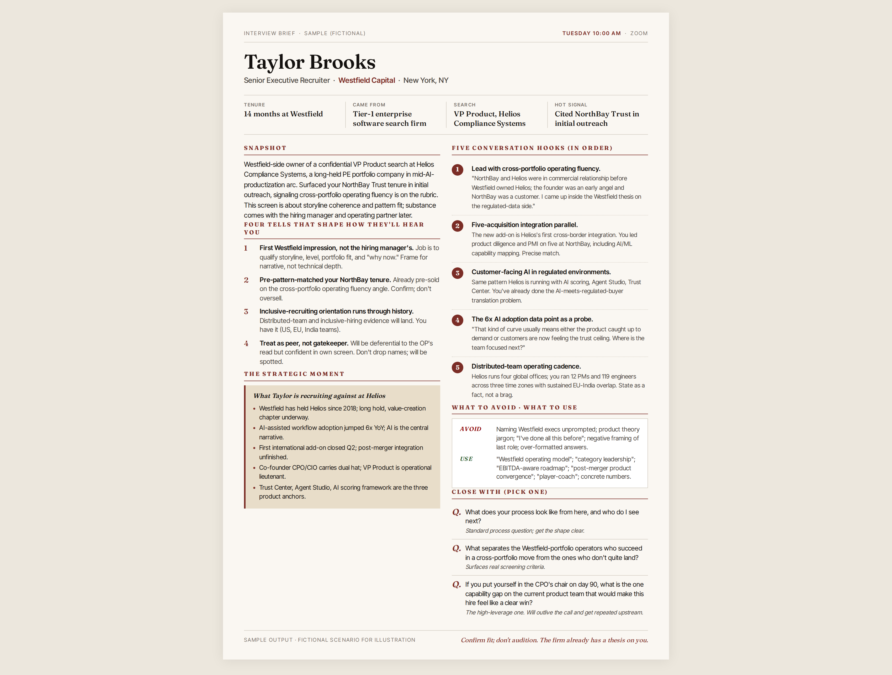

# Job Interview Meeting Preparation

A Claude plugin that prepares you for a high-stakes meeting with a
specific person at a specific company. It researches the company and
the stakeholder, works out how that person will hear what you say,
and hands you a brief plus a one-pager to keep on screen during the
call.

## Start here: which meeting are you preparing for?

Pick the row that matches your meeting. The research is the same for
all four; what changes is how you open, what you avoid saying, and
how you close.

| Your meeting | Who is across the table | What the prep sharpens |
|---|---|---|
| **An interview** | A recruiter, hiring manager, or panel evaluating you | How your experience maps to the problem they are hiring to solve; questions that make you memorable |
| **A peer or stakeholder** | A cross-functional peer, an internal stakeholder you need on side, a partner or BD counterpart, or a buyer in sales discovery | The shared objective, what they need to see to commit, and who else shapes the decision |
| **An operator** | A GM, COO, or functional head running the business, or a private-equity operating partner | Where their operating gap is, the number they least want to defend, and where outside help lands |
| **A board member or other CxO** | A director, CEO, investor, or C-suite executive | Leading with the decision or risk, enterprise framing (capital, risk, growth, governance), and what they need before the next meeting |

Tell Claude which one it is ("prep me for an operator meeting with
the COO of Acme on Thursday"). If you do not say, the skill asks
before it starts research.

The plugin was built originally for interview prep against
private-equity portfolio companies, where the stakeholder is often a
recruiter or operating partner with a thesis already formed about the
candidate.

## Then: what the prep produces

Once the meeting type is set, the skill works in this order:

1. **Research** the company (and any second company that matters to
   the conversation), in parallel, from primary sources.
2. **Read the stakeholder**: career arc, credentials, and the
   "tells" that explain how they think.
3. **Build the conversation**: opening hooks, probing angles, an
   avoid/use cheat sheet, and closing questions, tailored to your
   meeting type.
4. **Deliver** an in-chat brief and a printable one-pager.



## Preparing for a series of meetings

For meetings that repeat or build on each other (interview rounds, a
standing operator check-in, quarterly board meetings, a multi-step
partnership or sales cycle), run the prep inside a **Claude Project**.
Keep each brief, your post-meeting notes, and any new documents in the
Project. Each new prep then starts from what you already know: the
tells carry forward, the brief notes what has changed since the last
meeting, and research that is still current is not repeated. The
result is sharper preparation with every meeting in the series. When
the skill sees a follow-up meeting outside a Project, it will suggest
moving there.

## What you get

Two artifacts, every time:

1. **An in-chat brief** with a snapshot of the stakeholder, four
   interpretive "tells" about how they think, the strategic moment
   the company is in, three to five conversation hooks ordered by
   priority, an avoid/use cheat sheet, and three closing questions
   calibrated to your meeting type.
2. **A printable one-pager** in editorial / financial-briefing style.
   Sized to sit at half-screen during a virtual meeting and to print
   cleanly on US Letter if you want it on paper. HTML and PDF both.

The methodology is opinionated. It treats the meeting as a strategic
event, not a checklist exercise, and the output reads like a memo
from a senior advisor rather than a generic prep document.

## Install

This plugin ships in the `enalbenerraw/blanewarrene` marketplace. Add the
marketplace once, then install the plugin:

```bash
claude plugin marketplace add enalbenerraw/blanewarrene
claude plugin install job-interview-meeting-preparation@blanewarrene-marketplace
```

Run `/reload-plugins` afterward to apply it to a running session.

Then trigger the skill in conversation:

```
prep me for an interview at <company> on <date>
prep me for a stakeholder meeting with <name>, <title> at <company>
prep me for an operator meeting with the COO of <company> on <date>
prep me for a board meeting at <company> next week
```

with a LinkedIn PDF attached if you have one. The skill loads
automatically based on the description in the frontmatter.

### PDF one-pager (local sessions only)

The skill produces an HTML one-pager plus a PDF. In local Claude Code,
rendering the PDF to spec (Letter, portrait, 0.4in margins) needs a
browser engine. Install Playwright once:

```
pip install playwright && playwright install chromium
```

Without it, the skill falls back to any installed browser, which may
not match the designed margins. Web and Cowork sessions need no setup.

## Inputs

Required:

- Meeting type: interview (default), peer or stakeholder, operator,
  or board or other CxO. Older labels still work: advisory maps to
  operator; partnership, BD, and sales discovery map to peer or
  stakeholder.
- Company name and URL (the company the stakeholder works at, or the
  company the meeting is about)
- Meeting date and time
- Stakeholder identity, ideally as a LinkedIn profile PDF; otherwise
  name plus title plus email domain

Optional but valuable:

- A secondary company that needs to be in the conversation (your own
  employer, a target, a partner, a competitor)
- Meeting objective beyond the obvious (e.g., "I want to leave the
  call with a sense of whether to take a second meeting")

## Methodology in brief

The full methodology is in [`skills/job-interview-meeting-preparation/SKILL.md`](skills/job-interview-meeting-preparation/SKILL.md). The seven steps:

1. **Capture inputs**: establish the meeting type first, then confirm
   what's provided; don't guess missing pieces. For a meeting in a
   series, build on earlier briefs.
2. **Announce the plan**: tell the user what the research will cover
   before doing it.
3. **Research the primary company**: financial trajectory, M&A,
   stated priorities, peer context, risk factors. Five to twelve web
   searches, primary sources first.
4. **Research the secondary company**: if applicable, focused on the
   relationship between the two.
5. **Analyze the stakeholder**: career arc, credentials, "tells"
   that explain how they think (not just what they did), and what
   strategic moment they walked into.
6. **Build the conversation architecture**: opening hooks, probing
   angles, avoid/use cheat sheet, closing questions, all calibrated
   to meeting type.
7. **Deliver outputs**: the in-chat brief and the one-pager.

The interpretive work in Step 5 is what separates this from a
boilerplate prep document. "Tells" are framings of how a stakeholder
will hear what you say, derived from the public record. Examples
from the methodology:

> "Insurance brokerage native; she will hear RIA M&A through a P&C
> broker M&A lens."
>
> "He's been at the company 18 years and just took the wealth seat;
> he is the institutional answer, not a fresh face."

## Example output

See [`skills/job-interview-meeting-preparation/examples/`](skills/job-interview-meeting-preparation/examples/)
for a sanitized worked output. The companies, names, and details are
fictional but the structure mirrors a real preparation cycle.

## Design notes on the one-pager

The template at `skills/job-interview-meeting-preparation/references/one-pager-template.html`
is intentional, not arbitrary. A few choices worth knowing if you
fork it:

- **Editorial / financial-briefing aesthetic**, not deck aesthetic.
  The audience is a single executive, not a room.
- **Two-column grid** so it reads at half-screen next to a Teams or
  Zoom window during the meeting.
- **Letter portrait, 0.4-inch margins** so the PDF prints cleanly on
  one page if anyone wants paper.
- **Fraunces (serif) for headlines, Inter Tight (sans) for body**.
  Loaded from Google Fonts.
- **Single accent color** in oxblood (`#7B2D26`) on a warm paper
  background. Avoids the slide-deck blues that signal generic
  business content.

## Caveats

- The methodology assumes you have web search and PDF rendering
  available. The web research step uses primary sources (10-K,
  press releases, IR pages); accuracy depends on the freshness of
  search results and the tooling. The skill instructs Claude to
  flag where the public record is thin.
- Citations are required on every factual claim from the web.
  Quotes are kept under fifteen words and one quote per source max.
  See [`skills/job-interview-meeting-preparation/SKILL.md`](skills/job-interview-meeting-preparation/SKILL.md).
- The skill stops at the door of the meeting. It does not produce
  post-meeting artifacts, follow-up notes, or thank-you templates
  by design.

## License

MIT. See [`LICENSE`](LICENSE).

## Author

[Blane Warrene](https://blanewarrene.com). Writing on
product positioning and AI at
[blanewarrene.com](https://blanewarrene.com).

Contributions, issues, and forks welcome.
